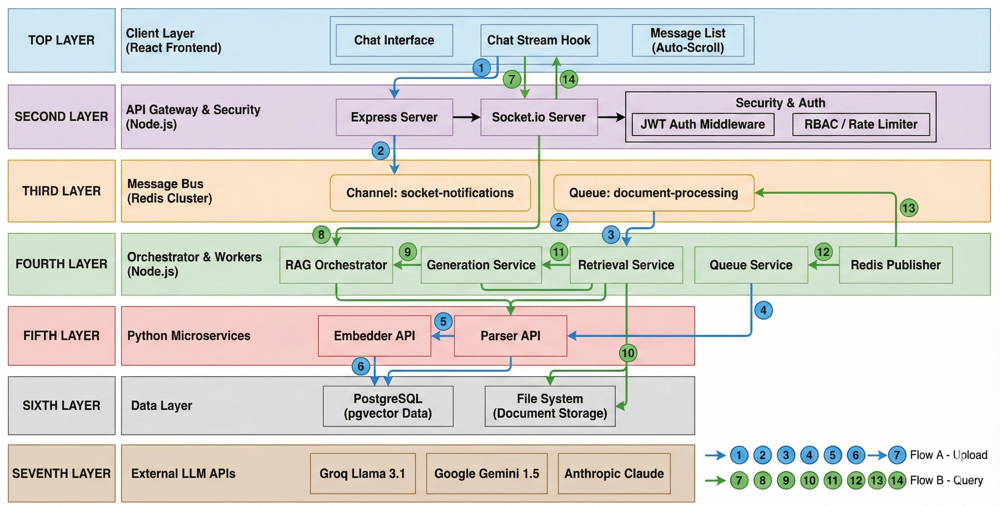

# VAULT: Enterprise AI Platform (Developer Reference)

## Documentation Index

1. [Executive Summary](#executive-summary)
2. [System Architecture](#system-architecture)
3. [Core Architecture & Design](#2-core-architecture--design)
4. [Enterprise RAG Pipeline](#22-the-enterprise-rag-pipeline)
5. [Technical Innovation & Architecture](#3-technical-innovation--architecture)
6. [Local Development Setup](#4-local-development-setup)
7. [API Reference](#5-api-reference)
8. [Performance Characteristics](#6-performance-characteristics)
9. [File Structure](#7-file-structure)
10. [Troubleshooting](#8-troubleshooting)
11. [Deployment Notes](#9-deployment-notes)


## **Executive Summary**

VAULT is a **production-grade AI platform** that delivers enterprise RAG capabilities at scale. The system features a sophisticated **hybrid retrieval engine**, **real-time streaming**, and **intelligent document processing** with cloud fallbacks.

**Key Achievements:**

- Processes 100+ page documents with intelligent OCR quality scoring  
- Implements hybrid search (vector + keyword + sequential) with intent detection
- Handles real-time streaming with cancellation and progress tracking
- Supports three distinct AI modes for different use cases

-----
## System Architecture

This diagram represents the current production-oriented target architecture for the VAULT platform.  
It reflects the live system components where implemented, and the planned scalability layers designed to support growth.

> **Note:** Other components are currently evolving as the platform continues to develop.


-----

## 1. Purpose

This document serves as the technical reference for **VAULT Enterprise AI Platform**, a multi-tenant RAG system designed for sensitive enterprise environments. 

VAULT provides **secure, isolated workspaces** where teams can upload confidential documents and perform natural language queries with **production-grade reliability** and **intelligent fallback mechanisms**.

-----

## 2. Core Architecture & Design

VAULT is a **distributed microservices platform** built on modern web technologies with enterprise-grade scalability and fault tolerance.

### 2.1. System Components

* **Frontend (React):** Modern, responsive SPA with real-time UI updates
  - **Zinc-themed Enterprise UI:** Professional dark/light mode interface
  - **Real-time Chat:** Token-by-token streaming with cancellation support
  - **Document Library:** Advanced modal with search and file management
  - **Conversation Management:** Delete, search, and organize chat history

* **Backend (Node.js/Express):** High-performance API gateway
  - **JWT Authentication:** Secure token-based auth with role validation
  - **Redis Pub/Sub:** Enterprise event bus for service decoupling
  - **PostgreSQL Integration:** Full ACID compliance with vector operations
  - **Async Controllers:** Non-blocking request handling with immediate 202 responses

* **Databases & Storage:**
  - **PostgreSQL (Primary):** Relational data with pgvector extension for embeddings
  - **Redis:** Message broker for queues and real-time pub/sub
  - **File Storage:** Local storage with proper cleanup procedures

* **AI/ML Services (Python Microservices):**
  - **Parser API (Port 8002):** Enterprise document parsing with OCR quality scoring and Azure Document Intelligence fallback
  - **Embedder API (Port 8001):** High-performance embedding service with in-memory model caching

* **Background Processing:**
  - **BullMQ Worker:** Distributed job processing with Redis
  - **Queue Service:** Orchestrates document ingestion pipeline
  - **Real-time Notifications:** WebSocket events for progress tracking

### 2.2. The Enterprise RAG Pipeline

VAULT's RAG system implements a **sophisticated multi-stage retrieval process** with intelligent routing and quality gates.

**1. Document Ingestion (Async Pipeline)**
```
User Upload → Immediate 202 Response → Redis Queue → Worker Process
```
- Files are processed asynchronously with real-time progress updates
- **Intelligent Parsing:** Local OCR with Azure cloud fallback based on quality scoring
- **Transactional Saves:** PostgreSQL operations with rollback on vector failures
- **Memory Management:** Automatic cleanup of failed uploads

**2. Hybrid Retrieval Engine**
- **Query Classification:** AI-powered intent detection (VECTOR, SQL_METADATA, LLM, ACTION)
- **Intent-Aware Routing:** Sequential reading for summarization vs hybrid search for Q&A
- **Multi-Stage Search:**
  - Vector similarity search (pgvector)
  - Keyword search (pg_trgm similarity)
  - Sequential reading for document summarization
- **Reciprocal Rank Fusion:** Intelligent result merging and ranking

**3. Multi-Mode Generation System**
- **STANDARD:** Fast, efficient responses for simple queries
- **DEEP_THINK:** Complex reasoning with chain-of-thought
- **DEEP_RESEARCH:** Comprehensive analysis of long documents
- **Mode Coordination:** Automatic mode switching based on retrieval results

**4. Real-time Streaming & Citations**
- Token-by-token streaming with WebSocket events
- Interactive citation badges with hover previews
- Math expression detection and execution
- Conversation history with fuzzy search

-----

## 3. Technical Innovation & Architecture

### 3.1. Database Architecture
```sql
-- PostgreSQL with pgvector extension
document_chunks (
    chunk_id SERIAL PRIMARY KEY,
    content TEXT,
    embedding VECTOR(384),  -- pgvector extension
    document_id INTEGER,
    room_id INTEGER,
    page_number INTEGER
);
```

### 3.2. Hybrid Search Implementation
```javascript
// Reciprocal Rank Fusion for result merging
const rankedResults = applyRRF(vectorResults, keywordResults, 60);
// Returns: [{ chunk_id, content, metadata, rrfScore, methods: ['Vector','Keyword'] }]
```

### 3.3. Intelligent Document Processing
```python
# OCR Quality Scoring (0-100 points)
def calculate_quality_score(local_chunks, file_path):
    score = 100
    # Penalize: empty content, OCR noise, size mismatches, low alphanumeric density
    # Fallback to Azure Document Intelligence if score < threshold
```

### 3.4. Real-time Event System
```javascript
// Redis Pub/Sub for service decoupling
redisPublisher.publish(NOTIFICATION_CHANNEL, JSON.stringify({
    targetSocketId: socketId,
    event: 'chat_response',
    data: { type: 'chunk', data: token }
}));
```

-----

## 4. Local Development Setup

### Prerequisites
- **Node.js** 18+ 
- **Python** 3.9-3.11
- **PostgreSQL** 14+ with pgvector extension
- **Redis** 6+ 

### Step 1: Clone & Setup
```bash
git clone https://github.com/vrishank-03/VAULT-Semantic-Search
cd VAULT-Semantic-Search
```

### Step 2: Backend Configuration
```bash
cd backend
npm install

# Environment setup
cp .env.example .env
# Configure: DATABASE_URL, REDIS_URL, JWT_SECRET, AZURE_FORM_*
```

### Step 3: Database Setup
```sql
-- Enable required extensions
CREATE EXTENSION IF NOT EXISTS vector;
CREATE EXTENSION IF NOT EXISTS pg_trgm;
```

### Step 4: Python Services
```bash
# Create virtual environment
python -m venv ml_env
source ml_env/bin/activate  # or .\ml_env\Scripts\activate on Windows

# Install Python dependencies
pip install -r requirements.txt
pip install "fastapi[standard]" "unstructured[local-inference]" "azure-ai-documentintelligence"
```

### Step 5: Run Services
**Terminal 1 - Database & Redis:**
```bash
# Ensure PostgreSQL and Redis are running
sudo service postgresql start
redis-server
```

**Terminal 2 - Embedder API:**
```bash
cd backend
source ml_env/bin/activate
python embedder.py
```

**Terminal 3 - Parser API:**
```bash
cd backend  
source ml_env/bin/activate
python parser.py
```

**Terminal 4 - Main Server:**
```bash
cd backend
node index.js
```

**Terminal 5 - Worker:**
```bash
cd backend
node worker.js
```

**Terminal 6 - Frontend:**
```bash
cd frontend
npm start
```

### Step 6: Verify Installation
1. Access `http://localhost:3000`
2. Create account and upload a PDF
3. Test chat functionality with real-time streaming

-----

## 5. API Reference

### Core Endpoints

**Chat Operations:**
```http
POST /api/chat/:roomId/:conversationId
# Async streaming with 202 response + Socket.io events

GET /api/chat/search?q=term
# Fuzzy search across conversation history

DELETE /api/chat/:conversationId  
# Delete conversation and all messages
```

**Document Management:**
```http
POST /api/documents/upload/:roomId
# Async processing with progress events

GET /api/documents/:roomId
# List documents with metadata

DELETE /api/documents/:documentId
# Remove document and all vectors
```

### WebSocket Events
```javascript
// Chat Streaming
socket.on('chat_response_' + conversationId, (data) => {
  // data.type: 'status'|'chunk'|'final'|'error'
});

// Document Processing  
socket.on('document_status', (data) => {
  // data.type: 'status'|'complete'|'error'
});
```

-----

## 6. Performance Characteristics

### Document Processing
- **Parsing:** 2-10 seconds per document (depending on size/complexity)
- **Embedding:** ~100ms per chunk
- **Upload Progress:** Real-time status updates

### Query Performance  
- **Vector Search:** < 100ms for typical queries
- **Hybrid Search:** 200-500ms with re-ranking
- **Streaming Response:** First token < 2 seconds

### Scalability
- **PostgreSQL:** Supports 10M+ document chunks
- **Redis:** Handles 10K+ concurrent WebSocket connections  
- **Python Services:** Horizontal scaling ready

-----

## 7. File Structure

```
backend/
├── services/
│   ├── RAGPipelineService.js    # Hybrid retrieval orchestration
│   ├── RetrievalService.js      # Vector + keyword + sequential search
│   ├── GenerationService.js     # Multi-mode AI responses
│   └── QueueService.js          # BullMQ worker & job management
├── controllers/
│   ├── chatController.js        # Async streaming endpoints
│   └── documentController.js    # File upload & management
├── database.js                  # PostgreSQL + pgvector interface
├── parser.py                    # Enterprise document parsing
├── embedder.py                  # High-speed embedding service
└── worker.js                    # Background job processor

frontend/src/
├── pages/ChatRoomPage/
│   ├── hooks/
│   │   ├── useChatStream.js     # WebSocket management
│   │   ├── useConversations.js  # Conversation state
│   │   └── useFileUpload.js     # Upload progress handling
│   └── components/
│       ├── ChatInput/           # Multi-mode input with attachments
│       ├── MessageBubble/       # Streaming UI with citations
│       └── DocumentLibraryModal/# Enterprise file management
├── context/
│   ├── SocketContext.js         # WebSocket provider
│   └── LayoutContext.js         # UI state management
└── services/api.js              # API client with error handling
```

-----

## 8. Troubleshooting

### Common Issues

**Database Connection:**
```bash
# Ensure PostgreSQL is running with pgvector
psql -c "CREATE EXTENSION IF NOT EXISTS vector;"
psql -c "CREATE EXTENSION IF NOT EXISTS pg_trgm;"
```

**Python Services:**
```bash
# Check if services are running
curl http://localhost:8001/health  # Embedder
curl http://localhost:8002/health  # Parser
```

**Redis Connection:**
```bash
# Test Redis connectivity
redis-cli ping  # Should return "PONG"
```

**File Upload Issues:**
- Check `/backend/storage` directory permissions
- Verify file size limits in Multer configuration
- Monitor worker process for processing errors

### Performance Optimization

**Database Indexing:**
```sql
CREATE INDEX CONCURRENTLY idx_document_chunks_embedding 
ON document_chunks USING ivfflat (embedding vector_cosine_ops);

CREATE INDEX CONCURRENTLY idx_document_chunks_room 
ON document_chunks(room_id);
```

**Cache Configuration:**
- Redis connection pooling
- Vector query result caching
- Session storage optimization

-----

## 9. Deployment Notes

### Production Considerations
- **PostgreSQL:** Connection pooling with PgBouncer
- **Redis:** Cluster configuration for high availability  
- **Python Services:** Gunicorn with multiple workers
- **Node.js:** PM2 process management
- **File Storage:** Cloud storage integration ready

### Monitoring & Observability
- Database query performance monitoring
- Redis memory usage tracking
- Python service health checks
- WebSocket connection metrics

### Security Hardening
- JWT token rotation
- API rate limiting
- File upload sanitization
- SQL injection prevention with parameterized queries

---
